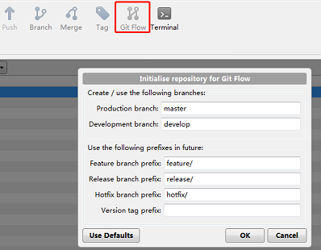
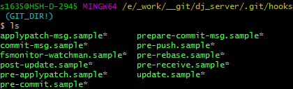

## Git 从新手到专家

---

### 1. 常见版本管理工具一览

###### 1.1 VSS
> VSS（Visual Source Safe），是 Microsoft Visual Studio 的一员，基于 C/S 架构的，只支持 windows 环境。（已被官方抛弃）


###### 1.2 CVS
> CSV（Concurrent Version System）, 是中心版本控制系统，C/S 架构也是 C/S 架构的，买2009 停止维护，大多数服务改迁至 SVN 维护。

###### 1.3 [TFS](https://visualstudio.microsoft.com/zh-hans/tfs/)
> TFS（Team Foundation Server）, TFS 是微软系产品，Windows 下小型团队开发利器，支持 SVN，最新版也支持 Git 的。

###### 1.4 [AB](https://www.alienbrain.com/)
> AB（AlienBrain），针对计算机图象及数字娱乐项目的资产管理系统

###### 1.5 [SVN](http://subversion.apache.org/)
> SVN（Subversion），是开源版本集中式版本控制系统，C/S 架构。

###### 1.6 [Git](https://git-scm.com/)
> Git 开源的分布式版本控制系统，可以有效、高速地处理从很小到非常大的项目版本管理。Git 是 Linus Torvalds 为了帮助管理 Linux 内核开发而开发的一个开放源码的版本控制软件。

### 2. SVN 和 Git 区别

###### 2.1 仓库的组织结构不同
> Git 属于分布式的仓库管理；SVN 属于中心式的仓库管理。
>
> 仓库的组织结构不同：Git 内部的对象层级依赖关系或许和 SVN 类似，工作树永远是一个完整的分支，不同的分支由不同的 head 索引去构建，同一时刻不可能出现在多个分支。
>
> SVN 默认采用 FSFS 的数据库格式，分支、tag 等默认只是一个不同的路径而已，本质上和普通路径没什么区别的。

###### 2.2 数据组织方式不同
> Git 把内容按元数据唯一哈希算法存储，Git 数据完整性更好；SVN 按照文件来组织。
>
> Git 把内容按照元数据方式存储，每次提交的文件全部内容（snapshot）都会记录，SVN 是按照文件存储的，存储每次提交(commit)之间的差异。

###### 2.3 版本号的不同
> Git 通过 SHA-1 哈希算法的唯一 commit 号辨识度低；SVN 更容易识别的全局唯一数字版本号。

###### 2.4 权限控制
> Git，只能针对仓库进行权限控制；SVN，可以对用户精确控制到文件级别的读写权限。

###### 2.5 日志查看
> Git 的代码日志是在本地的；SVN 日志在服务器上的，必须连网查看。

###### 2.6 远程提交
> Git 两段式提交：`git commit` --> `git push`；SVN 一次性提交 `svn commit`。

###### 2.7 远程更新
> Git 使用 `git fetch` 或 `git pull` 分段式更新；SVN 直接 `svn update` 即可。

###### 2.8 多分支协作
> Git，使用 `git checkout` 来切切换分支；SVN， `svn switch` 切换分支协同工作。
>>
>> 多模块合作：Git 的另一种解决方案 Git Submodule。
>>
>> 多分支协作：Git，使用 Checkout 后，只更新当前分支的内容的，不更新其他分支的，多分支操作一般是 fetch 远程分支 然后 merge 到当前分支的。
>
> SVN，使用 Switch 可以在同一个工作树上，对不同的模块 checkout 不同分支上的代码。

### 3. Git 对象（object）

##### 3.1 什么是对象
> 对象（object），表示版本历史信息的文件
>
> 通过一个 40 个字符的（40-digit）“对象名” 来索引的，对象名看起来像这样:
>> 3ff87c4664981e243g625791c8ea3bbb5f2279a3。
>
> 对象名是对文件内容用 SHA1 哈希计算得来的，保证对象名的唯一性。


##### 3.2 对象的构成
>  对象 = 类型 + 内容（内容取决于对象的类型） + 内容大小。

###### 3.2.1 类型
```
2.1 blob   -- 用来存储文件数据，通常是一个文件；
2.2 tree   -- 类似目录，用来管理一些 tree 和 blob；
2.3 commit -- 一个 commit 只指向一个 tree，标记项目某一个特定的时间点状态，
              包括一些时间点的是元数据，如 时间戳、最后一个提交者等；
2.4 tag    -- 标记某一个 commit 的方法。
```

### 4. Git 的四区及使用时的数据转换
##### 4.1 四区划分
> 本地 3 区：工作区（workspace）、暂存区（index）、本地仓库（local repository）
>
> 远程 1 区：远程仓库（remote repository）

##### 4.2 四区间数据转换

```
  工作区            暂存区              本地仓库            远程仓库
   | --> add (-u) --> |                     |                   |
   | <-- checkout <-- |                     |                   |
   | <--   diff   --> |                     |                   |
   | rm --cached  <-- |                     |                   |
   |                  |  -->   commit   --> |                   |
   |                  |  <-- reset HEAD <-- |                   |
   | <-----------  diff HEAD  ------------> |                   |
   | ----------->  commit -a  ------------> |                   |
   | <----------- checkout HEAD <---------- |                   |
   |                  |                     | -->   push   -->  |
   |                  |                     | <--  fetch   <--  |
   | <-----------   merge     <-----------  |                   |
   | <-----------        pull or rebase       <------------     |
```


### 5. Git 常用命令众生相
##### 5.1 常用命令

```lua
$git help
$git init                                       $git clone url
$git config –global user.name  "user_name"
$git config –global user.email "email@gmail.com"
$git branch                                     $git branch -a
$git branch -d/D branch_name
$git checkout -b new_branch_name                $git checkout file_name
$git fetch                                      $git fetch –prune
$git pull
$git log                                        $git show
$git status -s                                  $git diff
$git add file_name                              $git mv file_A file_B
$git rm file_name                               $git rm --cached file_name
$git merge other_branch_name
$git commit                                     $git push
```

##### 5.2 高级命令
```lua
$git commit --amend -m new_message //修改上次提交的msg
$git blame -L 38,40 file_name      //查看文件逐行修改
$git reset –head HEAD              //回退到上个版
$git reset commit_hash             //回退到指定的提交
$git revert HEAD                   //撤销最近操作
$git revert commit                 //撤销某次操作
$git stash                         //代码暂存
$git stash pop                     //代码取出
$git cherry-pick 38361a68          //复制一个提交的工作
$git tag                           //里程碑管理
$git rebase -i HEAD~4              //重新定义起点
$git clean -n                      //删除未被跟踪文件
$git reflog                        //查看所有分支操作
$git shortlog                      //日志的汇总查询
$git remote -v show [remote]       //远程仓库操作
$git archive                       //生成可发布的压缩包
$git bisect start HEAD 4d83cf      //二分查找错误开始
$git bisect good/bad               //二分查找错误标记状态
$git gc --aggressive --auto        //数据维护和恢复
```

##### 5.3 奇技淫巧
```lua
$git branch -m old_name new_name               //修改分支名
$git log --follow file_name                    //显示某个文件的历史
$git push origin --delete branch_name          //删除远程分支-1
$git push origin :remote_branch_name           //删除远程分支-2
$git branch -dr remote/branch_name             //删除远程分支-3
$git push origin :refs/tags/tag_name           //删除远程tag
$git remote add short_name url                 //添加新别名的远程仓库
$git log –reverse -p                           //历史重演
$git show HEAD~1                               //历史追溯
$git shortlog -sn --no-merges                  //提交次数排行榜
$git diff --shortstat "@{0 day ago}"           //查看今天的代码行数
$git whatchanged --since='2 weeks ago'         //查看最近两周的记录
$git config --global alias.st status           //给命令起别名
$git bundle create file_name branch_name       //把分支导出成文件
$git clone repo.bundle repo_dir -b branch_name //从包中导入分支
```

### 6. .gitignore 停止跟踪文件
> 文本文件 .gitignore 可以防止一些特定的文件进入到版本控制中。

> 查看所有项目中忽略的文件 `$git ls-files --others --ignored --exclude-standard`

|  规则       |    备注                             |
|:--:         | :--:                                |
| fd1/*       | 忽略目录 fd1 下面的全部内容         |
| /fd1/*      | 忽略根目录下的 /fd1/ 目录的全部内容 |
| !.gitignore | 不忽略 .gitignore 文件              |
| !/fw/sf/    | 不忽略 根目录下的 /fw/sf/ 目录      |

### 7. git config 配置文件
##### 7.1 文件路径
> 1. `/etc/gitconfig` 文件：包含了适用于系统所有用户和所有库的值。 --system
> 2. `~/.gitconfig` 文件：具体到你的用户。 --global
> 3. `.git/config` 文件：Git 目录的，
>>
>> Windows下：
>>> 一般位于 C:\Documents and Settings\$USER\.gitconfig 下
>
> 配置文件优先级：  3 > 2 > 1，优先级高的值覆盖优先级低的值。


##### 7.2 可以配置的内容
> 姓名和邮箱（必须配置）、编辑器、比较工具、配置命令别名或自定义命令、配置显示颜色……。

### 8. 安装使用管理

##### 8.1 在 Linux 上安装
1. Fedora : `$sudo yum install -y git`
2. Debian : `$sudo apt-get install -y git`
3. [更多系统安装](https://git-scm.com/download/linux)

##### 8.2 在 Windows 上安装
1. [Git](https://git-scm.com/download/win)
2. [msysGit](https://gitforwindows.org?_blank)
3. [GitHub for Windows](https://desktop.github.com)
4. Window GUI 支持:
   4.1 [TortoiseGit](https://tortoisegit.org/download/)
   4.2 [Sourcetree](https://www.sourcetreeapp.com/)
   4.3 VSCode 插件。

##### 8.3 认证方式
> 一般使用 ssh 认证，当然也可以使用 http。
>
> http 方式的话，Github 只支持 Public 的库，私有库必须使用 ssh 方式。

##### 8.4 仓库和权限管理
* 纯人肉
> 把所有用户的公钥保存在 authorized_keys 文件。

* 自己搭建 Git 服务器：
1. [GitLab](https://about.gitlab.com/pricing/#gitlab-com)
2. [Gitosis](https://git-scm.com/book/en/v1/Git-on-the-Server-Gitosis)

* 使用第三方平台：
1. [Github](https://github.com/)
2. [腾讯工蜂](https://git.code.tencent.com/)
3. [阿里云项目管理](https://code.aliyun.com/)
4. [码云](Gitee：https://gitee.com/)

### 9. 分支合并及冲突解决

##### 9.1 git merge 的 fast-forward 合并
```lua
  当待合并的分支比当前分支超前的话，会发生快速合并。

  $git checkout master && git merge test

                  HEAD                                     HEAD
                   |                                        |
                 master                                   master
                   |                                        |
  A_0 --> A_1 --> A_2 --> B_1  ==> A_0 --> A_1 --> A_2 --> B_1
                           |                                |
                          test                             test
```

##### 9.2 git merge 的 –no-ff 合并
```lua
  不想快速合并，加上 --no-ff 的非快速合并，会新建一个节点保留被合并记录。

  $git checkout master && git merge –no-ff test

                  HEAD                                        HEAD
                   |                                            |
                 master                                      master
                   |                                            |
  A_0 --> A_1 --> A_2         ==> A_0 --> A_1 --> A_2 -------> A_3【新增】
                      \                              \      /
                       > B_1                          > B_1
                          |                              |
                         test                          test
```

##### 9.3 git merge 的 –squash 合并
```lua
  SVN 的合并方式，新增一个节点，但是不保留对被合并分支的引用信息。

  $git checkout master && git merge –squash test

                  HEAD                                        HEAD
                   |                                            |
                 master                                      master
                   |                                            |
  A_0 --> A_1 --> A_2         ==> A_0 --> A_1 --> A_2 -------> A_3【新增】
                      \                              \
                       > B_1                          > B_1
                          |                              |
                         test                          test
```

##### 9.4 git rebase

```lua
  当要合并两个分叉的分支时

  1. merge 是将待合入分支和当前分支不同的部分，在当前分支新建节点。

  $git checkout master && git merge –no-ff test

                 HEAD                               HEAD
                  |                                  |
                master                             master
                  |                                  |
  A_0 --> A_1 --> A_2   ==> A_0 --> A_1 --> A_2 --> A_3【新增】
              \                         \        /
               >  B_1                    >  B_1
                  |                          |
                 test                       test

  2. rebase 会将合入分支上超前的节点在待合入分支上重新提交一遍。

  $git checkout master && git rebase test

                 HEAD                               HEAD
                  |                                  |
                master                             master
                  |                                  |
  A_0 --> A_1 --> A_2   ==> A_0 --> A_1 --> A_2 --> B_1'【从新提交 B_1】
              \                         \
               >  B_1                    >  B_1
                  |                          |
                 test                       test
```

----

##### 9.5 git cherry-pick
```lua
  只合并某一个分支的某一个特定节点，而不是分支所有的记录。

  $git checkout master && git cherry-pick B_1

                 HEAD                               HEAD
                  |                                  |
                master                             master
                  |                                  |
  A_0 --> A_1 --> A_2   ==> A_0 --> A_1 --> A_2 --> B_1【复制 B_1】
              \                         \
               >  B_1 -> B_2             >  B_1 --> B_2
                          |                          |
                        test                       test
```
##### 9.6 冲突解决
```lua
不同分支修改同一份文件时，在合并时可能出现冲突。比如
    $git merge feature1
      Auto-merging readme.txt
      CONFLICT (content): Merge conflict in readme.txt
      Automatic merge failed; fix conflicts and then commit the result.

Git用 <<<<<<<，=======，>>>>>>> 标记出不同分支的内容，比查看 readme.txt 如：
    <<<<<<< HEAD
    Creating a new branch is quick & simple.
    =======
    Creating a new branch is quick AND simple.
    >>>>>>> feature1

我们修改如下后保存：
    Creating a new branch is quick and simple.

保存后再提交：
    $git add readme.txt && git commit -m "conflict fixed"
```

### 10. 团队开发实践之 GitFlow
##### 10.1 什么是 Gitflow
> Gitflow，一个荷兰人 nvie 提出的一个基于 Git 版本开发的模型，包括以下内容：
>
>> 1. master  分支，1 个，总是稳定版本的代码，随时可发布；
>> 2. develop 分支，1 个，合并 feature 分支的，可用于创建 release 版本。
>> 3. feature 分支，同时存在多个；
>> 4. release 分支，同一时间只有 1 个，周期很短，为了发布版本；
>> 5. hotfix  分支，同一时间只有 1 个，周期较短，用来修复 bug 或小粒度修改发布。

* [GitFlow官网](https://nvie.com/posts/a-successful-git-branching-model)
* [作者 Github](https://github.com/nvie)

##### 10.2 图解 GitFlow


##### 10.3 GitFlow 的模型使用
* [gitflow 库支持 GitFlow 模型](https://github.com/nvie/gitflow)
* [SourceTree 软件的 gitflow](https://www.sourcetreeapp.com/)



### 11. 基于 Git 的高效团队协作
##### 11.1 Git + Jenkins 自动化集成
> git 提交代码后 --> 自动或手动触发 jenkins 执行相应脚本 --> 查看构建历史。

##### 11.2 通过编程实现 Git 的自动化
* [JGit](http://www.eclipse.org/jgit/)，用于操作 git 的纯 Java 库。

* [GitPython](https://pypi.org/project/GitPython/)，与 Git 交互的 python 库。安装方式：`$sudo pip install gitpython`

##### 11.3 Git + Jira 高效开发
> 在 Jira 中查看 Git 提交，分支，标签和请求。
>
> 连接 git 服务器 + GitHub、Bitbucket、GitLab 和 Azure、Repos、VSTS/TFS

* [Jira 官网](https://www.atlassian.com/zh/software/bitbucket)

### 12. 杂项：子模块钩子和大文件管理
##### 12.1 GIT Submodule
```lua
GIT Submodule，项目间是独立的，但是项目需要使用其他项目的时候。

$git submodule add sub_project_url add_path //添加子项目
$git submodule init                         //初始化子模块
$git submodule update --recursive           //更新子模块
$git submodule foreach git pull             //更新所有子模块

//以下为删除子模块操作
$rm -rf sub_project_dir                     //删除子模块目录及源码
$vi .gitmodules                             //删除项目目录下子模块相关条目
$vi .git/config                             //删除配置项中子模块相关条目
$rm .git/module/*                           //删除模块下的子模块目录
$git rm --cached sub_project_name
```

##### 12.2 Git 钩子
> Git 钩子：在特定的重要动作发生时触发自定义脚本，分客户端和服务端钩子。
>
> 位置：在 Git 目录下的 hooks 子目录中。 即项目中 `.git/hooks` 。
>
> 客户端钩子：提交工作流钩子、电子邮件工作流钩子和其它钩子。服务端钩子：对项目强制执行各种类型的策略。
>
> 任何可执行的文件都可以作为钩子的脚本。



###### 12.2.1 钩子样例（commit-msg）
```lua
#!/usr/bin/env python
# coding=utf-8
# commit msg checker

import sys, re, io

if hasattr(sys.stdout, 'buffer'):
    sys.stdout = io.TextIOWrapper(sys.stdout.buffer, encoding='utf-8')

TIPS_INFO = '''
不符合 commit 规范，提交失败（当前状态等于没做刚刚的 commit 操作），请按下面规则从新提交！

commit 规范：
   类型: 详细消息

说明:
   类型     -  功能、优化、Bug；
   连接符   -  英文冒号 + 空格，即 “: ”；
   详细信息 -  自定义描述，当类型是 Bug 时，详细信息必须要包括 Jira 上的Bug 标识 “OTDEFECT-” 或 “修复” 字样。

规范样例：
1. 功能: 匹配增加接受确认步骤
2. 优化: 天梯匹配分组优化
3. Bug: OTDEFECT-1001  当通过玩家ID搜索站内信时，结果能返回但是标题等字段返回值为空
4. Bug: 修复通过接口不能踢人的问题
'''

def check_commit_line1_format(msg):
    regOther = r'\S{3,} (.){4,100}'
    if msg.find("功能") != 0 and msg.find("优化") != 0 and msg.find("Bug") !=0 and msg.find(": ") != -1:
        return False

    if msg.find("Bug") == 0 and msg.find("OTDEFECT-") != -1 and msg.find("修复") != -1:
        return False

    matchObj = re.match(regOther, msg)
    return matchObj

if __name__=="__main__":
    with open(sys.argv[1], 'r', encoding='utf-8') as f:
        for line in f:
            if (check_commit_line1_format(line)):
                sys.exit(0)
            else:
                print(TIPS_INFO)
                sys.exit(1)
```

##### 12.3 Git LFS
> GIT 提交文件，不要超过 100M，GitHub 超过 50M 警告、超过 100M 禁止。
>
> Git LFS 是 Github 开发的一个 Git 的扩展，用于实现 Git 对大文件的支持。
>
> 在 Working with large files - GitHub Help 中提到：不建议对大文件如日志、database 等使用 Git 进行版本控制，如果非要有这种需求，则建议使用 Git LFS。


###### 12.3.1 安装
**注意**：安装 Git LFS 需要 Git 的版本不低于 1.8.5。不管什么系统，安装后都需要全局初始化一次。

* Linux
```lua
$curl -s https://packagecloud.io/install/repositories/github/git-lfs/script.deb.sh | sudo bash
$sudo apt-get install git-lfs
$git lfs install
```

* Mac
```lua
//安装 HomeBrew
$/usr/bin/ruby -e "$(curl -fsSL https://raw.githubusercontent.com/Homebrew/install/master/install)"
$brew install git-lfs
$git lfs install
```

* Windows
1. 下载：[git-lfs](https://github.com/git-lfs/git-lfs/releases)
2. 运行 windows installer（git-lfs-windows-v2.8.0.exe）
3. 在命令行执行 `$git lfs install`

###### 12.3.2 使用
```lua
$git lfs install         //需要在项目根目录执行一次，初始化
$git lfs track README.md //跟踪大文件
$git lfs track           //显示被跟踪的文件
$git add .gitattributes  //需要跟踪记录大文件信息 .gitattributes 文件
$git add README.md
$git commit -m "Add README.md and init git-lfs"
$git push
$git lfs clone URL       //lfs clone ，或者直接 git clone
```

###### 12.3.3 相关资源
1. [git-lfs ](https://github.com/git-lfs/git-lfs)
2. [git-lfs - windows](https://git-lfs.github.com/)
3. [git-lfs - Release](https://github.com/git-lfs/git-lfs/releases)
4. [git-lfs - 参考](https://zzz.buzz/zh/2016/04/19/the-guide-to-git-lfs/)
5. [lfs 删除文件](https://help.github.com/cn/articles/removing-files-from-git-large-file-storage)
6. [使用 filter-branch 从 Git 历史中删除一个文件](https://blog.walterlv.com/git/2017/09/19/delete-file-using-filter-branch.html)
7. [使用 BFG Repo-Cleaner 清除 git 的历史错误提交](http://openfibers.github.io/blog/2015/03/04/use-bfg-to-clean-big-blog-in-git/)

### 13. 进一步的探索
##### 13.1 学习资料
1. [Book - Pro Git](https://git-scm.com/book/en/v2) [中文版](https://git-scm.com/book/zh/v2)
2. [Git Handbook](https://guides.github.com/introduction/git-handbook)
3. [GitCheatSheets](https://github.github.com/training-kit)
4. [Book - gotgit](https://github.com/gotgit/gotgit)
5. [GitCommunityBook](http://gitbook.liuhui998.com/)
6. [Git Internals](https://github.com/pluralsight/git-internals-pdf)
7. [猴子都能懂的GIT入门](https://backlog.com/git-tutorial/cn/)
8. [Git 菜单](https://github.com/geeeeeeeeek/git-recipes/blob/master/README.md)
9. [如何使用 Git 和 GitHub - 代码版本控制](https://cn.udacity.com/course/how-to-use-git-and-github--ud775)

##### 13.2 工作流的资料
1. [GitFlow](https://nvie.com/posts/a-successful-git-branching-model)
2. [Git Workflows](http://documentup.com/skwp/git-workflows-book)
3. [git-town](https://github.com/Originate/git-town)
4. [git-workflow](https://github.com/asmeurer/git-workflow)

##### 13.3 交互式学习
1. [LearnGitBranch](https://learngitbranching.js.org)
2. [Visualizing Git](https://git-school.github.io/visualizing-git/)
3. [Git-It](https://github.com/jlord/git-it-electron#what-to-install)

##### 13.4 工具或软件
1. [Git Command Explorer](https://gitexplorer.com)
2. [GIT CHEATSHEET](https://ndpsoftware.com/git-cheatsheet.html)
3. [GUI Clients](https://git-scm.com/downloads/guis)
4. [git 常见问题搜索](http://firstaidgit.io/#/)
5. [一些可能有用的脚本](https://github.com/unixorn/git-extra-commands)

---
