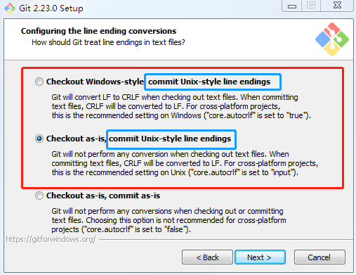

## Git 换行符处理

---

### 1. 换行符的区别及导致的问题
#### 1.1 不同系统的换行符
> Windows 下是 `<回车><换行>`，即 `CRLF`（`\r\n` 或 `0d0a`）。
>
> Linux 下是 `<换行>`，即  `LF`（`\n` 或 `0a`）。
>
> Mac 下 `<回车>`，即  `CR`（`\n` 或 `0d`），MAC OS X 以后与 Linux 下一致，使用 `<换行>`，即  `LF`（`\n` 或 `0a`）。

#### 1.1 导致的问题
> 不同系统所定义的换行格式不同，导致的直接后果是，Unix/Mac 系统下的文件在 Windows 里打开的话，所有文字会变成一行；而 Windows 里的文件在 Unix/Linux 下打开的话，在每行的结尾会多车一个 `^M` 字符。

### 2. Git 换行符的统一处理
> 为了统一，我们一般都会使用 Linux 下的换行符 `LF` 作为统一的文件换行符（特殊的 Windows 文件，比如 `.jpg` 等除外）。

#### 2.1 Windows 设置
##### 2.1.1 Git for Windows
> 打开 `Git Bash` 工具，用命令行设置
>
> `$ git config --global core.autocrlf false`，关闭自动换行符转换功能。
>
> `$ git config --global core.safecrlf true`，避免文件中有混用换行符。

##### 2.1.2 修改全局配置文件
> 路径 Win7 下：`C:\Users\S1635\.gitconfig`
>
> 如下设置
```lua
...
[core]
    autocrlf = false
    safecrlf = true
...
```

##### 2.1.3 说明
> `core.autocrlf` 值说明：
>
>> `true` - 在 Windows 系统上，当签出代码时，`LF` 会被转换成 `CRLF`，即 `x -> LF -> CRLF`。
>> `input` - 在提交时把 `CRLF` 转换成 `LF`，签出时不转换，即 `x -> LF -> LF`；
>> `false` - 关闭自动转化功能，即 `x -> x -> x`。

> `core.safecrlf` 值说明：
>
>> `false` - 不做任何检查；
>> `warn` - 在提交时检查并警告；
>> `true` - 在提交时检查，如果发现混用则拒绝提交。

#### 2.2 安装 Git.exe 选择使用 `LF` 换行符
> 安装 Git 时，比如 `Git-2.23.0-64-bit.exe` 时，到如下图界面，如图选择即可。都可以保证，提交至版本库的代码都会被统一转化成 `LF` 风格。原理如图下描述。
>
> 

#### 2.3 出现 `LF` 和 `CRLF` 混用时导致的文件自动 modify 状态
> 假如有人提交了`LF` 和 `CRLF` 混用的文件，会导致文件在签出到本地时就已经是修改的状态的。这是混用换行符导致的。
>
> 解决方案 1 如下：
>
>> 1. 把 `core.autocrlf` 设置为 `false`；
>>
>> 2. 人工将该文件的换行符统一修改为 `LF` 并提交；
>>
>> 3. 把 `core.autocrlf` 设置为 `true`。
>>
>> 4. 为了避免类似问题再出现，根据前面的章节 `2. Git 换行符的统一处理` 进行设置。

#### 2.4 换行符的终极处理方案
> bash 脚本文件应当使用 `LF` 作为换行符，如果使用 `CRLF` 风格的换行符，bash 解释器可能无法正常工作；
>
> Windows 批处理 bat 文件最好使用 `CRLF` 作为换行符，如果使用 `LF` 风格的换行符，且代码中包含了中文字符，那么解释器可能无法正常工作。
>
> 可以上可以通过 [unix2dos 和 dos2unix 解决，参考 1.4 部分内容](https://github.com/xingangshi/config_tools/blob/master/awesome_commnd_tips.md#1.4 批量转换文件换行符)。
>
> **假如是二进制文件被自动转换那就欲哭无泪的。**

##### 2.4.1 `.gitattributes` 功能
> Git 对一个特定的子目录或子文件运用一些设置项，可以在你项目的根目录中的 `.gitattributes` 文件内进行设置。
> 当你不想让这些属性文件和项目文件一同提交时，在 `.git/info/attributes` 进行设置。

##### 2.4.2 关于换行符的使用规则
> 使用 `* text=auto` 可以定义开启全局的换行符转换；
>
> 使用 `*.bat text eol=crlf` 保证 Windows 的批处理文件在 checkout 至工作区时，始终被转换为 `CRLF` 风格的换行符；
>
> 使用 `*.sh text eol=lf` 保证 Bash 脚本无论在哪个平台上，只要被 checkout 至工作区，始终被保持 `LF` 风格的换行符；
>
> 使用 `*.jpg -text` 禁止 Git 将 `jpg` 文件识别为文本文件，避免由于换行符转换导致数据损坏。

##### 2.4.3 进一步的学习
> `.gitattributes` 详细使用方法，可以 [参考](https://git-scm.com/docs/gitattributes)。
>
> `.gitattributes` 文件模板大全，[传送门](https://github.com/alexkaratarakis/gitattributes)。

### 参考资料
1. [gitattributes - Defining attributes per path](https://git-scm.com/docs/gitattributes)
2. [A collection of useful .gitattributes templates](https://github.com/alexkaratarakis/gitattributes)
3. [git-config Manual Page](https://gitirc.eu/git-config.html)
